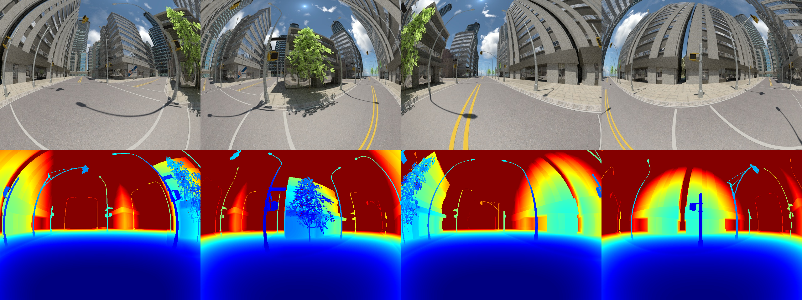
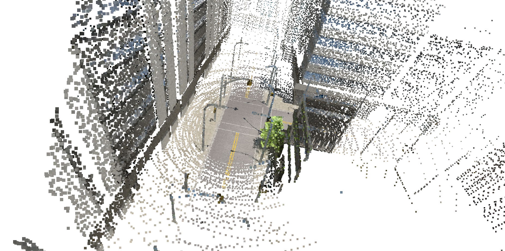
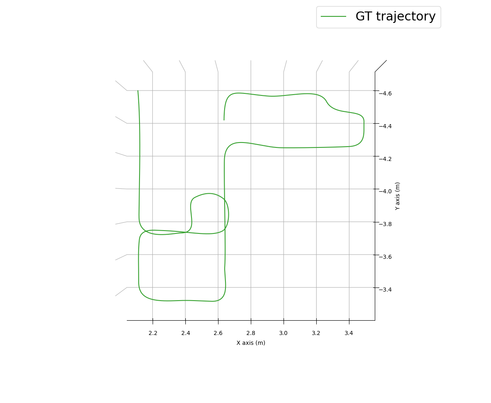

# A demo for playing with MultiCam dataset

This dataset is based on the MultiFoV [1] dataset.

For building instructions please refer
to [the main README](../../../../README.md). Make sure to build in
the `RelWithDebugInfo` or `Release` configuration (on the generation step
do `cmake .. -DCMAKE_BUILD_TYPE=RelWithDebInfo`), otherwise the point cloud
generation may run a long time.

After building the demo, go to the root directory of the repository, then run
the demo:

```bash
cd ..
./build/demo/dataset/multicam/multicam_demo/multicam_demo mcam_dir
```

where `mcam_dor` is a directory with the MultiCam dataset (it must
contain `data` and `info` folders).

## Output

You will find all outputs of the demo in the folder `output/date_time`,
where `date` and `time` have been substituted with the actual date and time of
the run. In the output you will find an image `alldepths.png` with ground-truth
depths for all pixels of a multi-frame, such as this one:


The point clouds generated from ground-truth depths are also in the output. You
can inspect them with [MeshLab](https://www.meshlab.net):

```bash
meshlab output/date_time/cloud.ply
```

If you encounter any problems, try first running `meshlab`, and then
using `Import Mesh` in the GUI. An example cloud with 10000 points per image:

You can create more dense clouds via modifying the `--cloud_points_per_frame`
flag value.

Finally, there is a ground-truth trajectory for the whole dataset: `gt_traj.txt`
. You can visualize it with a script `showtraj.py` we provide:

```bash
python3 py/util/trajectory/showtraj.py  output/date_time/gt_traj.txt \
    --labels "GT trajectory" -p xy
```

An example output:


You can notice that the scale of the dataset is not aligned to meters, although
the depths and the vehicle poses are, of course, aligned between each other.

## References

[1] Zhang, Zichao, et al. "Benefit of large field-of-view cameras for visual
odometry." 2016 IEEE International Conference on Robotics and Automation (ICRA).
IEEE, 2016.
