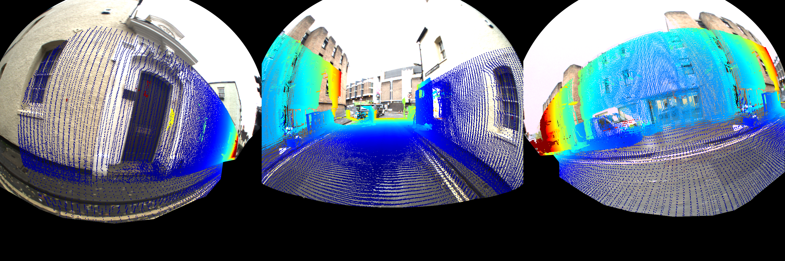
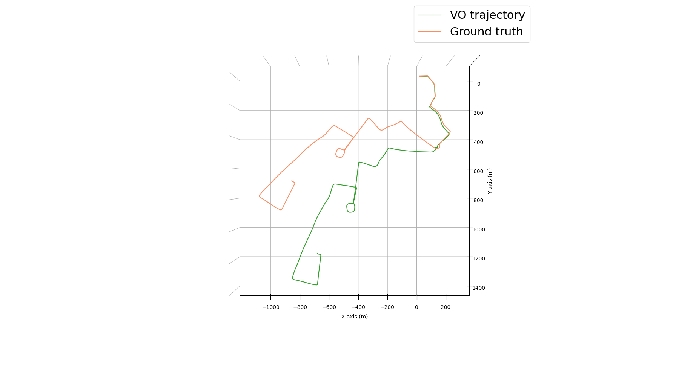

# A demo for playing with Oxford Robotcar [1] dataset

For building instructions please refer
to [the main README](../../../../README.md). Make sure to build in
the `RelWithDebugInfo` or `Release` configuration (on the generation step
do `cmake .. -DCMAKE_BUILD_TYPE=RelWithDebInfo`), otherwise the point cloud
generation runs a very long time.

After building the demo, go to the root directory of the repository, then run
the demo:

```bash
cd ..
./build/demo/dataset/robotcar/lidar_cloud/lidar_cloud \
    robotcar_chunk_dir robotcar_rtk_dir
```

where `robotcar_chunk_dir` is a directory with one of the Robotcar dataset
chunks, e.g. `/home/mt/data/oxford-robotcar/2015-08-17-10-26-38` (example
outputs here are from this one), and `robotcar_rtk_dir` is a directory with RTK
ground truth trajectories as provided by the authors of the dataset,
e.g. `/home/mt/data/oxford-robotcar/rtk`.

## Output

You will find all outputs of the demo in the folder `output/date_time`,
where `date` and `time` have been substituted with the actual date and time of
the run. In the output you will find an image `projected.png` with LiDAR points
projected on a frame from the provided chunk, such as this one:

Note that the car parts have been masked out by hand-drawn masks also provided
by us.

The point clouds generated by LiDARs are also in the output. You can inspect
them with [MeshLab](https://www.meshlab.net), for example:

```bash
meshlab output/date_time/lidar_front.ply
```

If you encounter any problems, try first running `meshlab`, and then
using `Import Mesh` in the GUI. An example cloud from the front LMS lidar:


Finally, there are trajectories provided by the authors of the
dataset: `vo_traj.txt` is the trajectory from the authors' visual odometry
and `gt_traj.txt` is the ground-truth RTK globally optimized trajectory. You can
visualize these with a script `showtraj.py` we provide:

```bash
python3 py/util/trajectory/showtraj.py  \
    output/date_time/vo_traj.txt \
    --gt output/date_time/gt_traj.txt \
    --labels "VO trajectory" -a -p xy
```

An example output:


## References

[1] W. Maddern, G. Pascoe, C. Linegar and P. Newman, "1 Year, 1000km: The Oxford
RobotCar Dataset", _The International Journal of Robotics Research (IJRR)_,
2016.
